# Code-for-Papers
This repository contains the links of code for partial papers.

------

# Classified catalogue

| [Geometry Processing](#GeometryOpt) | [Low-level Vision](#Low-level) | [Human Face](#Face) | [Human Body](#Body) |
| ---- | ---- | ---- | ---- |
| [Geodesic Distance Computation](#GeodesicDistance) | [Depth Estimation](#DepthEstimation) | [Face Reconstruction](#FaceReconstruction) | [Body Reconstruction](#BodyReconstruction) |
| [ADMM](#ADMMs) | [Stereo Matching](#StereoMatching) | [Facial Motion Retargeting](#FaceRetargeting) | [Body Representation](#BodyRepresentation) |
| [Mesh Filtering](#MeshFiltering) | [Optical Flow](#OpticalFlow) | [Face Recognition](#FaceRecognition) | [Human Digitization](#HumanDigitization) |
| [Anderson Acceleration](#AndersonAcceleration) | [Surface Registration](#Registration) | [Face Alignment](#FaceAlignment) | |
| |  | [Face Representation](#FaceRepresentation) | |
| |  | [Face Synthesis](#FaceSynthesis) | |

------
<a name="GeometryOpt"/>

# Geometry Optimization & Mesh Processing

<a name="GeodesicDistance"/>

## Geodesic Distance Computation

<table
    style="width:100%;border:0px;border-spacing:0px;border-collapse:separate;margin-right:auto;margin-left:auto;">
    <tbody>
        <tr>
        <td style="vertical-align:middle">
            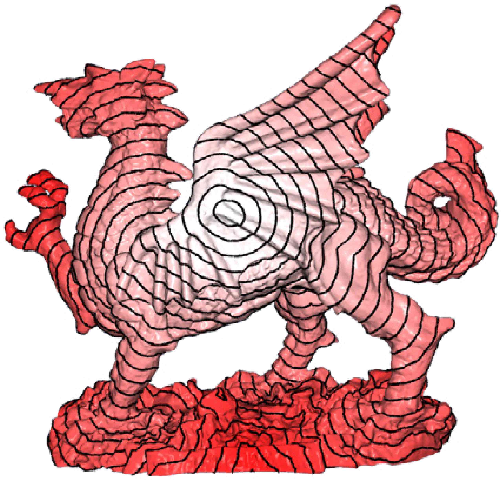
        </td>
        <td style="padding:20px;width:75%;vertical-align:middle">
            <papertitle><strong>Parallel and Scalable Heat Methods for Geodesic Distance Computation</strong></papertitle>
            </a>
             
            Jiong Tao, Juyong Zhang, Bailin Deng, Zheng Fang, Yue Peng, Ying He
             
            IEEE Transactions on Pattern Analysis and Machine Intelligence (TPAMI), 2021
             
            <a href="https://arxiv.org/abs/1812.06060">paper</a> /
            <a href="https://github.com/bldeng/ParaHeat">code</a>
            

            
In this paper, we propose a parallel and scalable approach for geodesic distance computation on triangle meshes.

        </td>
        </tr>
    </tbody>
</table>

<a name="ADMMs"/>

## ADMM

<table
    style="width:100%;border:0px;border-spacing:0px;border-collapse:separate;margin-right:auto;margin-left:auto;">
    <tbody>
        <tr>
        <td style="vertical-align:middle">
            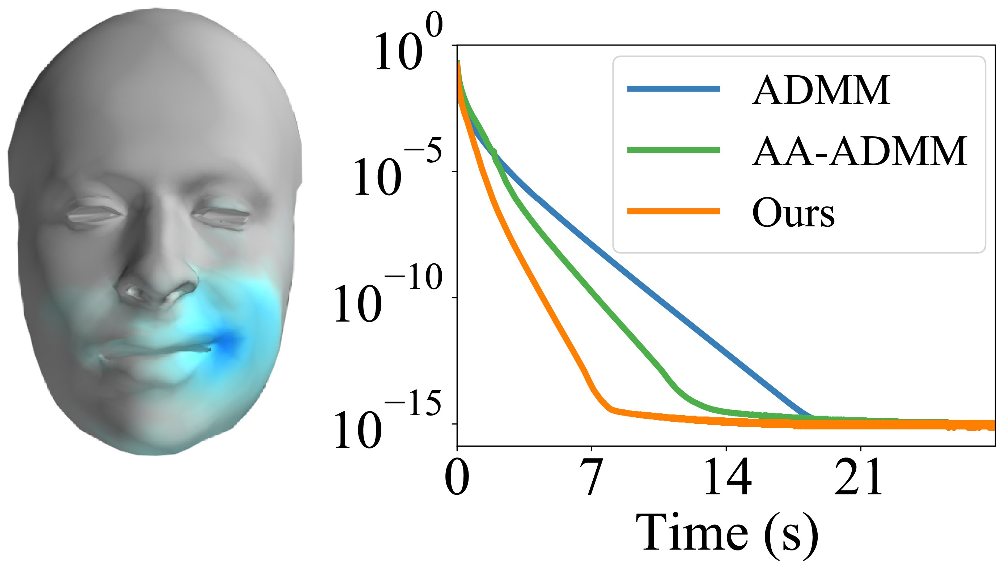
        </td>
        <td style="padding:20px;width:75%;vertical-align:middle">
            <papertitle><strong>Anderson Acceleration for Nonconvex ADMM Based on Douglas-Rachford Splitting</strong></papertitle>
            </a>
             
            Wenqing Ouyang, Yue Peng, Yuxin Yao, Juyong Zhang, Bailin Deng
             
            Computer Graphics Forum (Symposium on Geometry Processing), 2020
             
            <a href="https://arxiv.org/abs/2006.14539">paper</a> /
            <a href="https://github.com/YuePengUSTC/AADR">code</a>
            

            
In this paper, we note that the equivalence between ADMM and Douglas-Rachford splitting reveals that ADMM is in fact a fixed-point iteration in a lower-dimensional space. By applying Anderson acceleration to such lower-dimensional fixed-point iteration, we obtain a more effective approach for accelerating ADMM.

        </td>
        </tr>
    </tbody>
</table>

<table
    style="width:100%;border:0px;border-spacing:0px;border-collapse:separate;margin-right:auto;margin-left:auto;">
    <tbody>
        <tr>
        <td style="vertical-align:middle">
            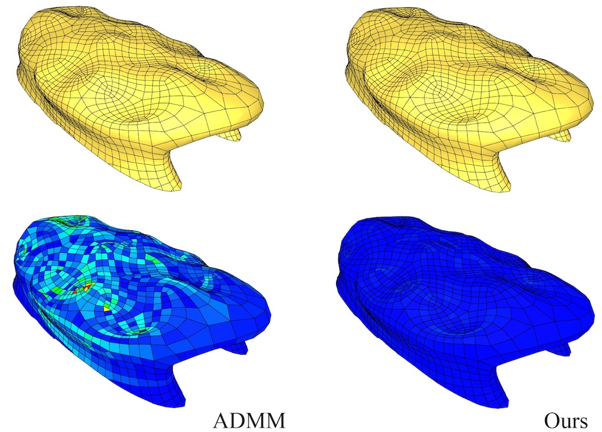
        </td>
        <td style="padding:20px;width:75%;vertical-align:middle">
            <papertitle><strong>Accelerating ADMM for Efficient Simulation and Optimization</strong></papertitle>
            </a>
             
            Juyong Zhang, Yue Peng, Wenqing Ouyang, Bailin Deng
             
            ACM Transactions on Graphics (SIGGRAPH ASIA), 2019
             
            <a href="https://arxiv.org/abs/1909.00470">paper</a> /
            <a href="https://github.com/bldeng/AA-ADMM">code</a>
            

            
We propose a method to speed up ADMM using Anderson acceleration, an established technique for accelerating fixed-point iterations. We show that in the general case, ADMM is a fixed-point iteration of the second primal variable and the dual variable, and Anderson acceleration can be directly applied.

        </td>
        </tr>
    </tbody>
</table>

<a name="MeshFiltering"/>

## Mesh Filtering

<table
    style="width:100%;border:0px;border-spacing:0px;border-collapse:separate;margin-right:auto;margin-left:auto;">
    <tbody>
        <tr>
        <td style="vertical-align:middle">
            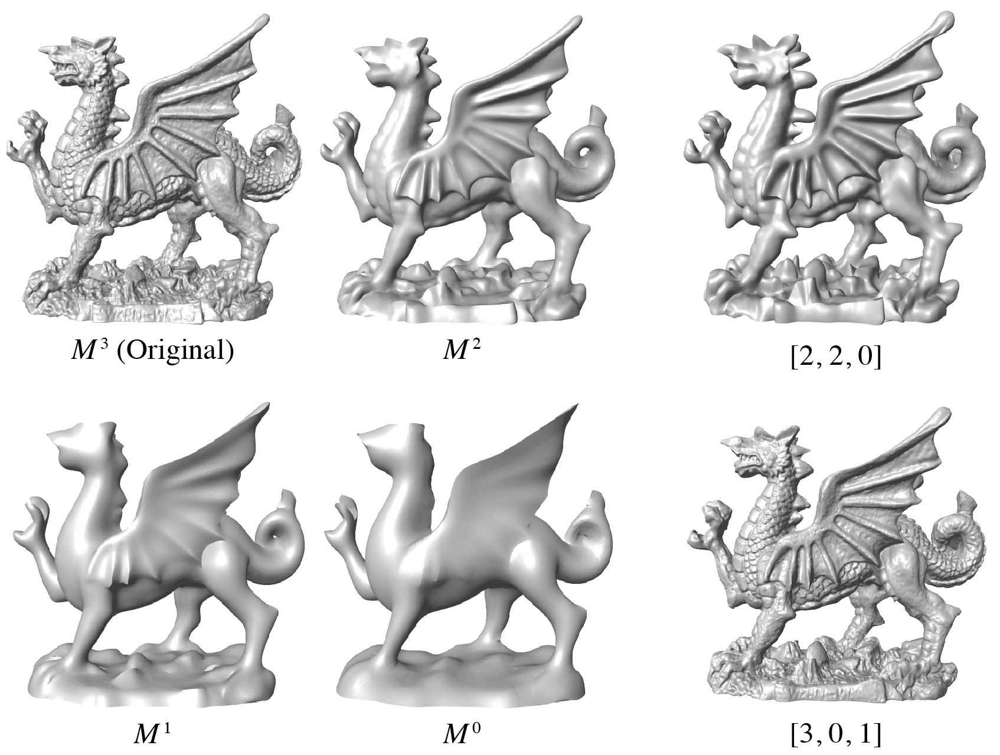
        </td>
        <td style="padding:20px;width:75%;vertical-align:middle">
            <papertitle><strong>Static/Dynamic Filtering for Mesh Geometry</strong></papertitle>
            </a>
             
            Juyong Zhang, Bailin Deng, Yang Hong, Yue Peng, Wenjie Qin, Ligang Liu
             
            IEEE Transactions on Visualization and Computer Graphics (TVCG), 2019
             
            <a href="https://arxiv.org/abs/1712.03574">paper</a> /
            <a href="https://github.com/bldeng/MeshSDFilter">code</a>
            

            
Inspired by recent advances in image filtering, we propose a new geometry filtering technique called static/dynamic filter, which utilizes both static and dynamic guidances to achieve state-of-the-art results.

        </td>
        </tr>
    </tbody>
</table>

<a name="AndersonAcceleration"/>

## Anderson Acceleration

<table
    style="width:100%;border:0px;border-spacing:0px;border-collapse:separate;margin-right:auto;margin-left:auto;">
    <tbody>
        <tr>
        <td style="vertical-align:middle">
            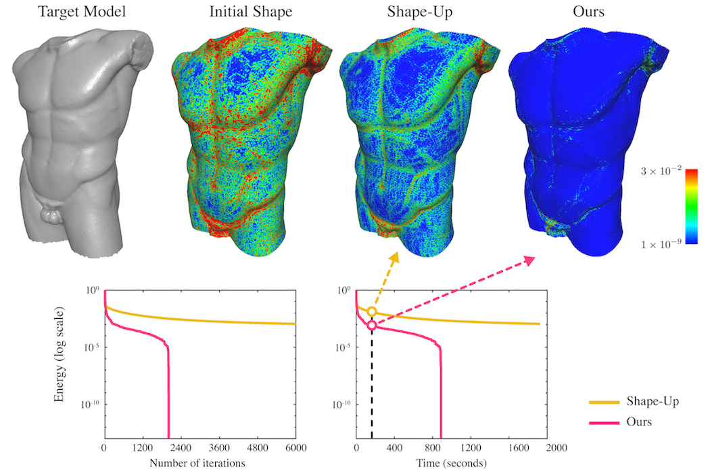
        </td>
        <td style="padding:20px;width:75%;vertical-align:middle">
            <papertitle><strong>Anderson Acceleration for Geometry Optimization and Physics Simulation</strong></papertitle>
            </a>
             
            Yue Peng, Bailin Deng, Juyong Zhang, Fanyu Geng, Wenjie Qin, Ligang Liu
             
            ACM Transactions on Graphics (SIGGRAPH), 2018
             
            <a href="https://arxiv.org/abs/1805.05715">paper</a> /
            <a href="https://github.com/bldeng/AASolver">code</a>
            

            
Local-global solvers developed in recent years can quickly compute an approximate solution to such problems, making them an attractive choice for applications that prioritize efficiency over accuracy. However, these solvers suffer from lower convergence rate, and may take a long time to compute an accurate result. In this paper, we propose a simple and effective technique to accelerate the convergence of such solvers.

        </td>
        </tr>
    </tbody>
</table>

<a name="Low-level"/>

# Low-level Vision

<a name="DepthEstimation"/>

## Depth Estimation

<table
    style="width:100%;border:0px;border-spacing:0px;border-collapse:separate;margin-right:auto;margin-left:auto;">
    <tbody>
        <tr>
        <td style="vertical-align:middle">
            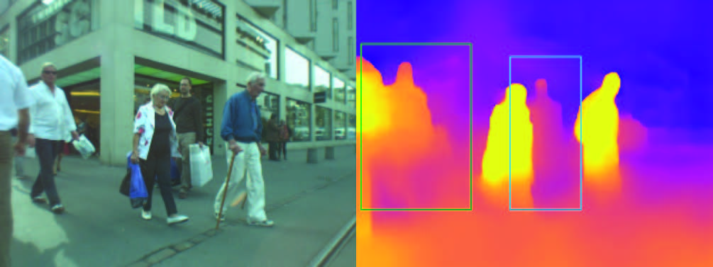
        </td>
        <td style="padding:20px;width:75%;vertical-align:middle">
            <papertitle><strong>Region Deformer Networks for Unsupervised Depth Estimation from Unconstrained Monocular Videos</strong></papertitle>
            </a>
             
            Haofei Xu, Jianmin Zheng, Jianfei Cai, Juyong Zhang
             
            International Joint Conference on Artificial Intelligence (IJCAI), 2019
             
            <a href="https://arxiv.org/abs/1902.09907">paper</a> /
            <a href="https://github.com/haofeixu/rdn4depth">code</a>
            

            
In this paper, we propose a new learning based method consisting of DepthNet, PoseNet and Region Deformer Networks (RDN) to estimate depth from unconstrained monocular videos without ground truth supervision.

        </td>
        </tr>
    </tbody>
</table>

<a name="StereoMatching"/>

## Stereo Matching

<table
    style="width:100%;border:0px;border-spacing:0px;border-collapse:separate;margin-right:auto;margin-left:auto;">
    <tbody>
        <tr>
        <td style="vertical-align:middle">
            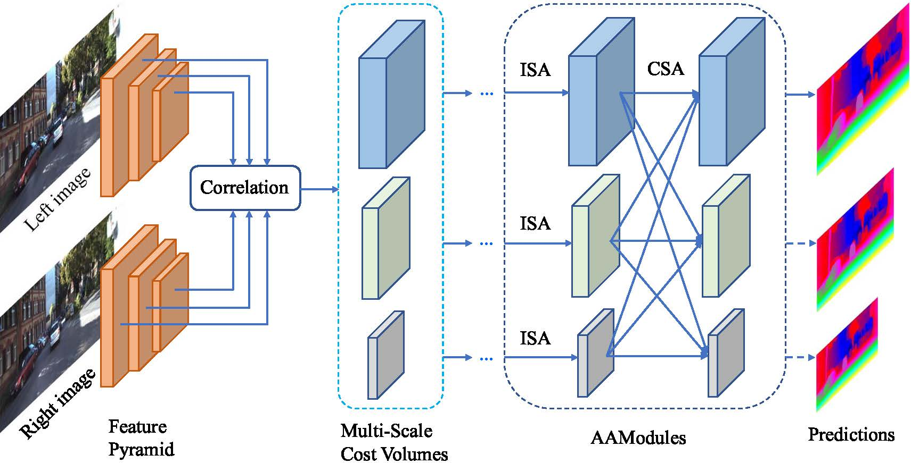
        </td>
        <td style="padding:20px;width:75%;vertical-align:middle">
            <papertitle><strong>AANet: Adaptive Aggregation Network for Efficient Stereo Matching</strong></papertitle>
            </a>
             
            Haofei Xu, Juyong Zhang
             
            IEEE/CVF Conference on Computer Vision and Pattern Recognition (CVPR), 2020
             
            <a href="https://arxiv.org/abs/2004.09548">paper</a> /
            <a href="https://github.com/haofeixu/aanet">code</a>
            

            
In this paper, we aim at completely replacing the commonly used 3D convolutions to achieve fast inference speed while maintaining comparable accuracy.

        </td>
        </tr>
    </tbody>
</table>

<a name="OpticalFlow"/>

## Optical Flow

<table
    style="width:100%;border:0px;border-spacing:0px;border-collapse:separate;margin-right:auto;margin-left:auto;">
    <tbody>
        <tr>
        <td style="vertical-align:middle">
            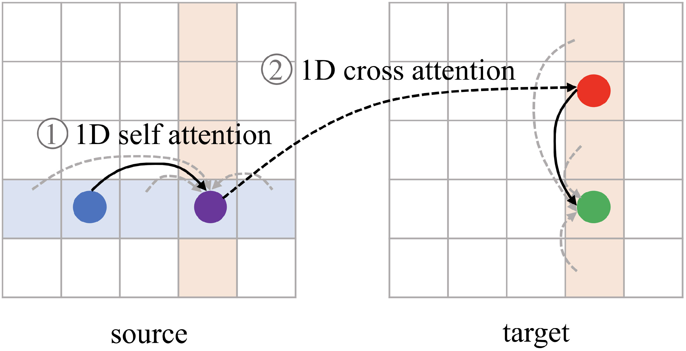
        </td>
        <td style="padding:20px;width:75%;vertical-align:middle">
            <papertitle><strong>High-Resolution Optical Flow from 1D Attention and Correlation</strong></papertitle>
            </a>
             
            Haofei Xu, Jiaolong Yang, Jianfei Cai, Juyong Zhang, Xin Tong
             
            IEEE International Conference on Computer Vision (ICCV), 2021
             
            <a href="https://arxiv.org/abs/2104.13918">paper</a> /
            <a href="http://staff.ustc.edu.cn/~juyong/publications.html">code</a>
            

            
We propose a new method for high-resolution optical flow estimation with significantly less computation, which is achieved by factorizing 2D optical flow with 1D attention and correlation.

        </td>
        </tr>
    </tbody>
</table>

<a name="Registration"/>

## Surface Registration

<table
    style="width:100%;border:0px;border-spacing:0px;border-collapse:separate;margin-right:auto;margin-left:auto;">
    <tbody>
        <tr>
        <td style="vertical-align:middle">
            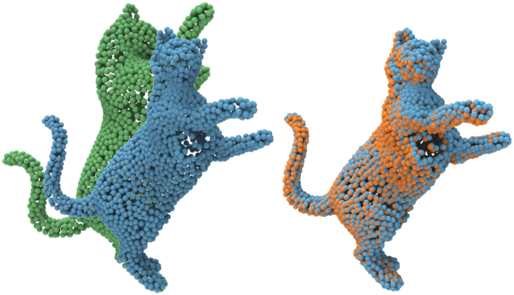
        </td>
        <td style="padding:20px;width:75%;vertical-align:middle">
            <papertitle><strong>Recurrent Multi-view Alignment Network for Unsupervised Surface Registration</strong></papertitle>
            </a>
             
            Wanquan Feng, Juyong Zhang, Hongrui Cai, Haofei Xu, Junhui Hou, Hujun Bao
             
            IEEE/CVF Conference on Computer Vision and Pattern Recognition (CVPR), 2021
             
            <a href="https://arxiv.org/abs/2011.12104">paper</a> /
            <a href="https://wanquanf.github.io/RMA-Net.html">project page</a> /
            <a href="https://github.com/WanquanF/RMA-Net">code</a>
            

            
For non-rigid registration, we propose RMA-Net to deform the input surface shape stage by stage. RMA-Net is totally trained in an unsupervised manner via our proposed multi-view 2D projection loss.

        </td>
        </tr>
    </tbody>
</table>

<table
    style="width:100%;border:0px;border-spacing:0px;border-collapse:separate;margin-right:auto;margin-left:auto;">
    <tbody>
        <tr>
        <td style="vertical-align:middle">
            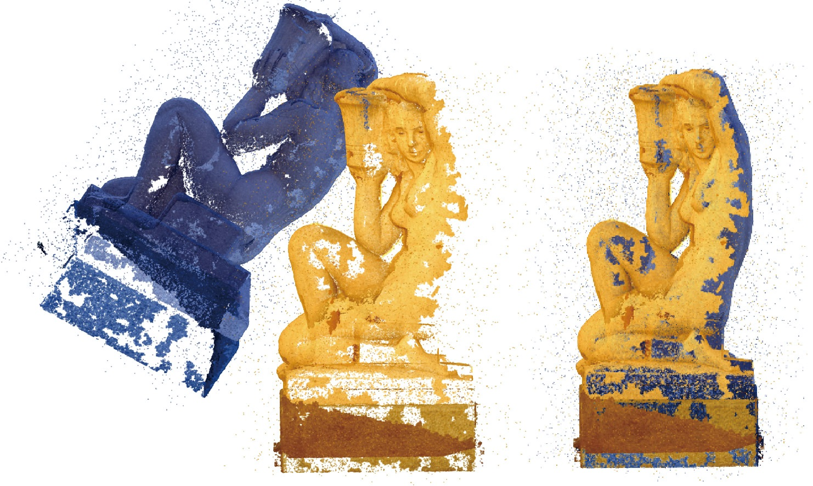
        </td>
        <td style="padding:20px;width:75%;vertical-align:middle">
            <papertitle><strong>Fast and Robust Iterative Closest Point</strong></papertitle>
            </a>
             
            Juyong Zhang, Yuxin Yao, Bailin Deng
             
            IEEE Transactions on Pattern Analysis and Machine Intelligence (TPAMI), 2021
             
            <a href="https://arxiv.org/abs/2007.07627">paper</a> /
            <a href="https://github.com/yaoyx689/Fast-Robust-ICP">code</a>
            

            
Recent work such as Sparse ICP achieves robustness via sparsity optimization at the cost of computational speed. In this paper, we propose a new method for robust registration with fast convergence.

        </td>
        </tr>
    </tbody>
</table>

<table
    style="width:100%;border:0px;border-spacing:0px;border-collapse:separate;margin-right:auto;margin-left:auto;">
    <tbody>
        <tr>
        <td style="vertical-align:middle">
            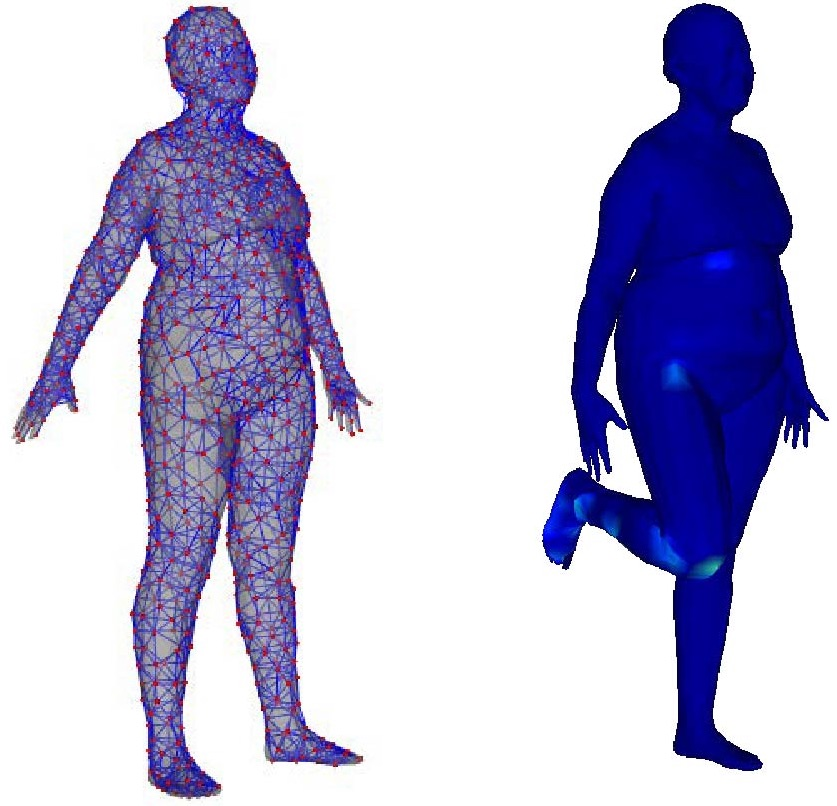
        </td>
        <td style="padding:20px;width:75%;vertical-align:middle">
            <papertitle><strong>Quasi-Newton Solver for Robust Non-Rigid Registration</strong></papertitle>
            </a>
             
            Yuxin Yao, Bailin Deng, Weiwei Xu, Juyong Zhang
             
            IEEE/CVF Conference on Computer Vision and Pattern Recognition (CVPR, Oral Presentation), 2020
             
            <a href="https://arxiv.org/abs/2004.04322">paper</a> /
            <a href="https://github.com/Juyong/Fast_RNRR">code</a>
            

            
In this paper, we propose a formulation for robust non-rigid registration based on a globally smooth robust estimator for data fitting and regularization, which can handle outliers and partial overlaps. We apply the majorization-minimization algorithm to the problem, which reduces each iteration to solving a simple least-squares problem with L-BFGS.

        </td>
        </tr>
    </tbody>
</table>

------

<a name="Face"/>

# Human Face

<a name="FaceReconstruction"/>

## Face Reconstruction

<table
    style="width:100%;border:0px;border-spacing:0px;border-collapse:separate;margin-right:auto;margin-left:auto;">
    <tbody>
        <tr>
        <td style="vertical-align:middle">
            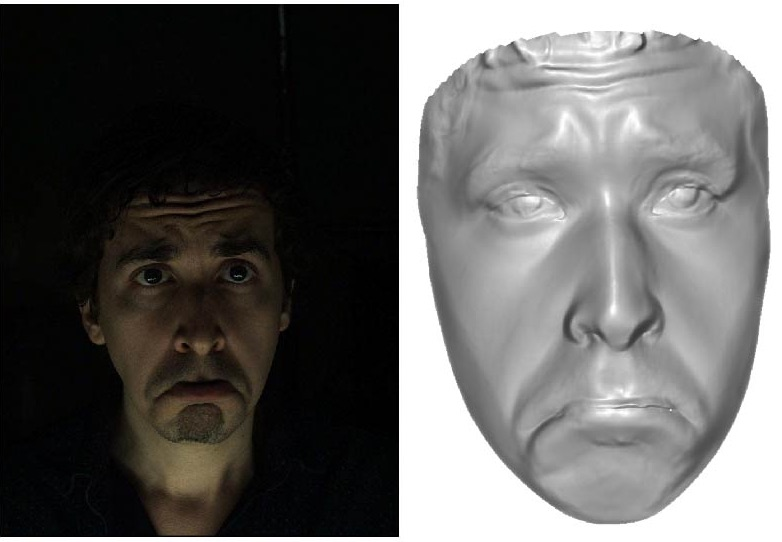
        </td>
        <td style="padding:20px;width:75%;vertical-align:middle">
            <papertitle><strong>Lightweight Photometric Stereo for Facial Details Recovery</strong></papertitle>
            </a>
             
            Xueying Wang, Yudong Guo, Bailin Deng, Juyong Zhang
             
            IEEE/CVF Conference on Computer Vision and Pattern Recognition (CVPR), 2020
             
            <a href="https://arxiv.org/abs/2003.12307">paper</a> /
            <a href="https://github.com/Juyong/FacePSNet">code</a>
            

            
In this paper, we present a lightweight strategy that only requires sparse inputs or even a single image to recover high-fidelity face shapes with images captured under near-field lights.

        </td>
        </tr>
    </tbody>
</table>

<table
    style="width:100%;border:0px;border-spacing:0px;border-collapse:separate;margin-right:auto;margin-left:auto;">
    <tbody>
        <tr>
        <td style="vertical-align:middle">
            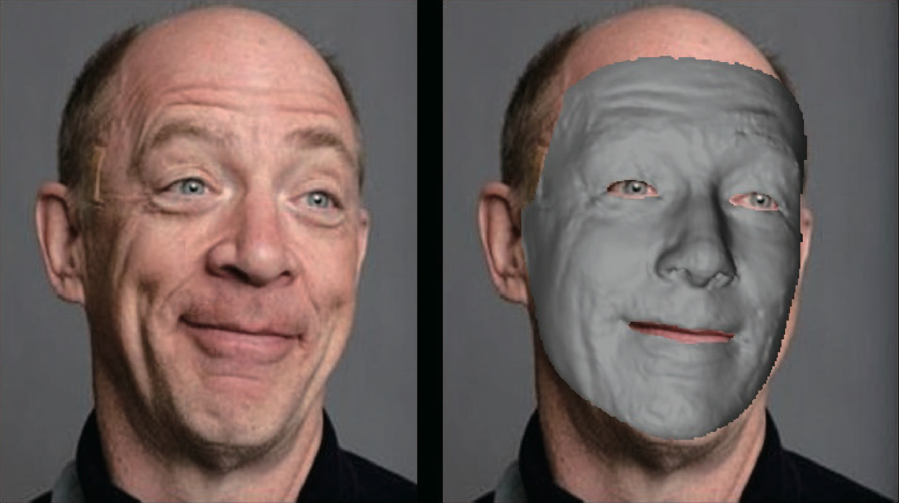
        </td>
        <td style="padding:20px;width:75%;vertical-align:middle">
            <papertitle><strong>CNN-based Real-time Dense Face Reconstruction with Inverse-rendered Photo-realistic Face Images</strong></papertitle>
            </a>
             
            Yudong Guo, Juyong Zhang, Jianfei Cai, Boyi Jiang, Jianmin Zheng
             
            IEEE Transactions on Pattern Analysis and Machine Intelligence (TPAMI), 2019
             
            <a href="https://arxiv.org/abs/1708.00980">paper</a> /
            <a href="https://github.com/Juyong/3DFace">dataset</a>
            

            
This paper presents a novel face data generation method. Specifically, we render a large number of photo-realistic face images with different attributes based on inverse rendering. Furthermore, we construct a fine-detailed face image dataset by transferring different scales of details from one image to another.

        </td>
        </tr>
    </tbody>
</table>

<table
    style="width:100%;border:0px;border-spacing:0px;border-collapse:separate;margin-right:auto;margin-left:auto;">
    <tbody>
        <tr>
        <td style="vertical-align:middle">
            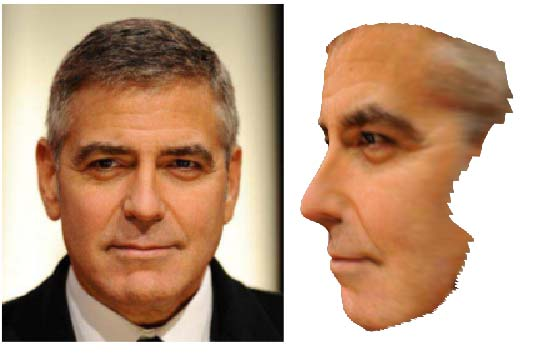
        </td>
        <td style="padding:20px;width:75%;vertical-align:middle">
            <papertitle><strong>3D Face Reconstruction with Geometry Details from a Single Image</strong></papertitle>
            </a>
             
            Luo Jiang, Juyong Zhang, Bailin Deng, Hao Li, Ligang Liu
             
            IEEE Transactions on Image Processing (TIP), 2018
             
            <a href="https://arxiv.org/abs/1702.05619">paper</a> /
            <a href="https://github.com/Juyong/SingleImageReconstruction">results</a>
            

            
Inspired by recent works in face animation from RGB-D or monocular video inputs, we develop a novel method for reconstructing 3D faces from unconstrained 2D images, using a coarse-to-fine optimization strategy.

        </td>
        </tr>
    </tbody>
</table>

<table
    style="width:100%;border:0px;border-spacing:0px;border-collapse:separate;margin-right:auto;margin-left:auto;">
    <tbody>
        <tr>
        <td style="vertical-align:middle">
            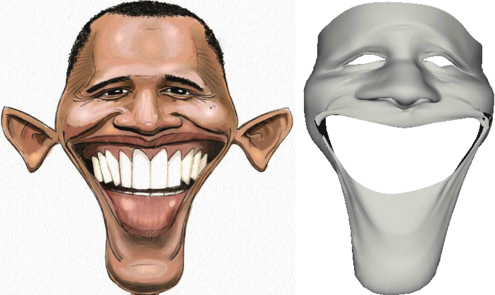
        </td>
        <td style="padding:20px;width:75%;vertical-align:middle">
            <papertitle><strong>Alive Caricature from 2D to 3D</strong></papertitle>
            </a>
             
            Qianyi Wu, Juyong Zhang, Yu-Kun Lai, Jianmin Zheng, Jianfei Cai
             
            IEEE Conference on Computer Vision and Pattern Recognition (CVPR), Spotlight Presentation, 2018
             
            <a href="https://arxiv.org/abs/1803.06802">paper</a> /
            <a href="https://github.com/QianyiWu/Caricature-Data">results</a>
            

            
While many caricatures are 2D images, this paper presents an algorithm for creating expressive 3D caricatures from 2D caricature images with a minimum of user interaction.

        </td>
        </tr>
    </tbody>
</table>

<a name="FaceRetargeting"/>

## Facial Motion Retargeting

<table
    style="width:100%;border:0px;border-spacing:0px;border-collapse:separate;margin-right:auto;margin-left:auto;">
    <tbody>
        <tr>
        <td style="vertical-align:middle">
            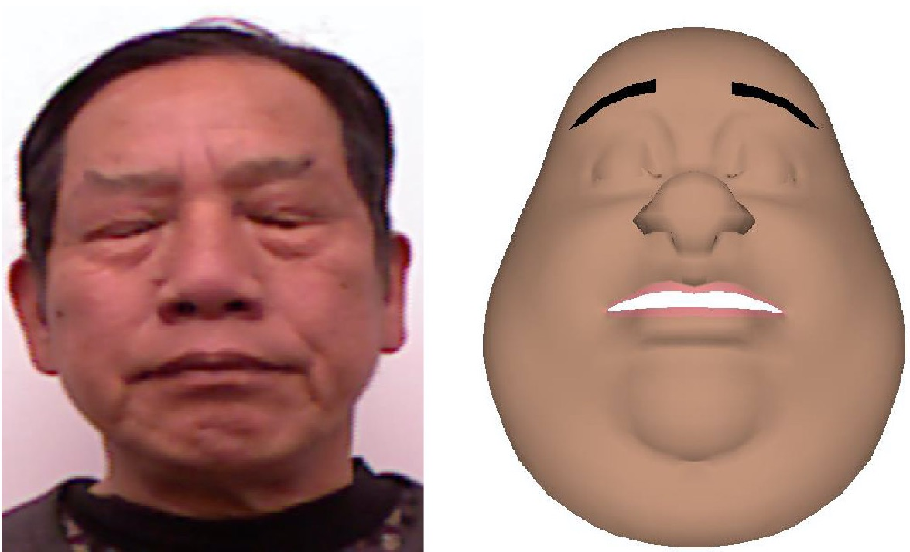
        </td>
        <td style="padding:20px;width:75%;vertical-align:middle">
            <papertitle><strong>Facial Expression Retargeting from Human to Avatar Made Easy</strong></papertitle>
            </a>
             
            Juyong Zhang, Keyu Chen, Jianmin Zheng
             
            IEEE Transactions on Visualization and Computer Graphics (TVCG), 2021
             
            <a href="https://arxiv.org/abs/2008.05110">paper</a> /
            <a href="https://github.com/kychern/FacialRetargeting">code</a>
            

            
We propose a brand-new solution to this cross-domain expression transfer problem via nonlinear expression embedding and expression domain translation.

        </td>
        </tr>
    </tbody>
</table>

<a name="FaceRecognition"/>

## Face Recognition

<table
    style="width:100%;border:0px;border-spacing:0px;border-collapse:separate;margin-right:auto;margin-left:auto;">
    <tbody>
        <tr>
        <td style="vertical-align:middle">
            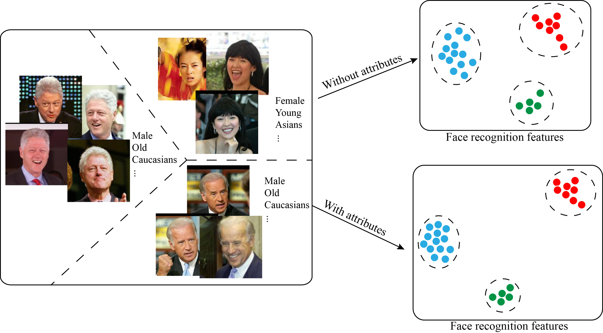
        </td>
        <td style="padding:20px;width:75%;vertical-align:middle">
            <papertitle><strong>Robust RGB-D Face Recognition Using Attribute-Aware Loss</strong></papertitle>
            </a>
             
            Luo Jiang, Juyong Zhang, Bailin Deng
             
            IEEE Transactions on Pattern Analysis and Machine Intelligence (TPAMI), 2020
             
            <a href="https://arxiv.org/abs/1811.09847">paper</a> /
            <a href="http://staff.ustc.edu.cn/~juyong/RGBD_dataset.html">dataset</a>
            

            
In this paper, we propose a new CNN-based face recognition approach that incorporates such attributes into the training process.

        </td>
        </tr>
    </tbody>
</table>

<a name="FaceAlignment"/>

## Face Alignment

<table
    style="width:100%;border:0px;border-spacing:0px;border-collapse:separate;margin-right:auto;margin-left:auto;">
    <tbody>
        <tr>
        <td style="vertical-align:middle">
            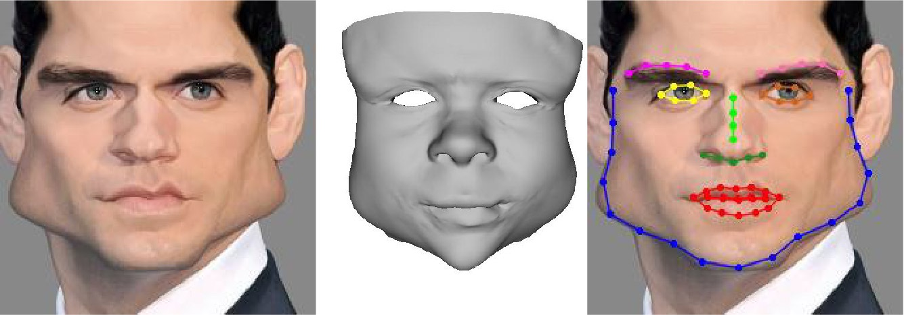
        </td>
        <td style="padding:20px;width:75%;vertical-align:middle">
            <papertitle><strong>Landmark Detection and 3D Face Reconstruction for Caricature using a Nonlinear Parametric Model</strong></papertitle>
            </a>
             
            Hongrui Cai, Yudong Guo, Zhuang Peng, Juyong Zhang
             
            Graphical Models, 2021
             
            <a href="https://arxiv.org/abs/2004.09190">paper</a> /
            <a href="https://github.com/Juyong/CaricatureFace">code</a>
            

            
To the best of our knowledge, this is the first work for automatic landmark detection and 3D face reconstruction for general caricatures.

        </td>
        </tr>
    </tbody>
</table>

<a name="FaceRepresentation"/>

## Face Representation

<table
    style="width:100%;border:0px;border-spacing:0px;border-collapse:separate;margin-right:auto;margin-left:auto;">
    <tbody>
        <tr>
        <td style="vertical-align:middle">
            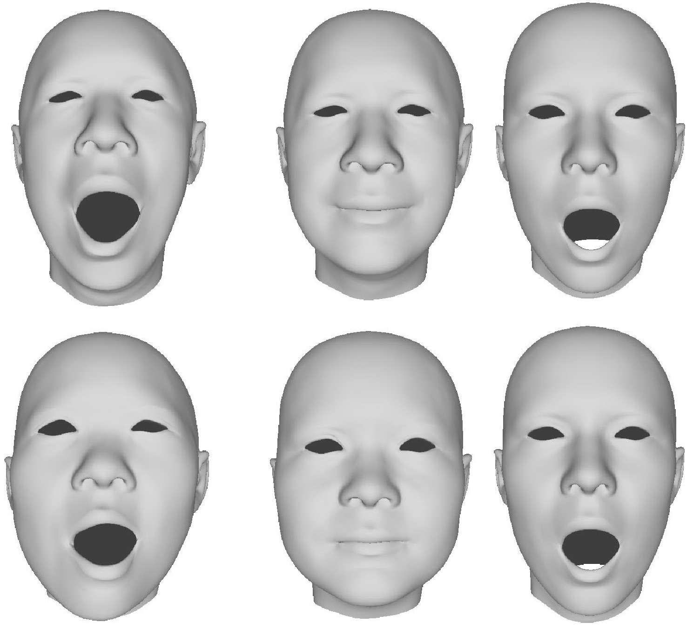
        </td>
        <td style="padding:20px;width:75%;vertical-align:middle">
            <papertitle><strong>Disentangled Representation Learning for 3D Face Shape</strong></papertitle>
            </a>
             
            Zi-Hang Jiang, Qianyi Wu, Keyu Chen, Juyong Zhang
             
            IEEE/CVF Conference on Computer Vision and Pattern Recognition (CVPR), 2019
             
            <a href="https://arxiv.org/abs/1902.09887">paper</a> /
            <a href="https://github.com/zihangJiang/DR-Learning-for-3D-Face">code</a>
            

            
In this paper, we present a novel strategy to design disentangled 3D face shape representation.

        </td>
        </tr>
    </tbody>
</table>

<a name="FaceSynthesis"/>

## Face Synthesis

<table
    style="width:100%;border:0px;border-spacing:0px;border-collapse:separate;margin-right:auto;margin-left:auto;">
    <tbody>
        <tr>
        <td style="vertical-align:middle">
            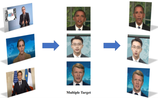
        </td>
        <td style="padding:20px;width:75%;vertical-align:middle">
            <papertitle><strong>AD-NeRF: Audio Driven Neural Radiance Fields for Talking Head Synthesis</strong></papertitle>
            </a>
             
            Yudong Guo, Keyu Chen, Sen Liang, Yongjin Liu, Hujun Bao, Juyong Zhang
             
            IEEE International Conference on Computer Vision (ICCV), 2021
             
            <a href="https://arxiv.org/abs/2103.11078">paper</a> /
            <a href="https://yudongguo.github.io/ADNeRF/">project page</a> /
            <a href="https://github.com/YudongGuo/AD-NeRF">code</a>
            

            
We address the talking head problem with the aid of neural scene representation
            networks. The feature of audio is fed into a conditional implicit function to generate a dynamic
            neural radiance field for high-fidelity talking-head video synthesis.

        </td>
        </tr>
    </tbody>
</table>

------

<a name="Body"/>

# Human Body

<a name="BodyReconstruction"/>

## Body Reconstruction

<table
    style="width:100%;border:0px;border-spacing:0px;border-collapse:separate;margin-right:auto;margin-left:auto;">
    <tbody>
        <tr>
        <td style="vertical-align:middle">
            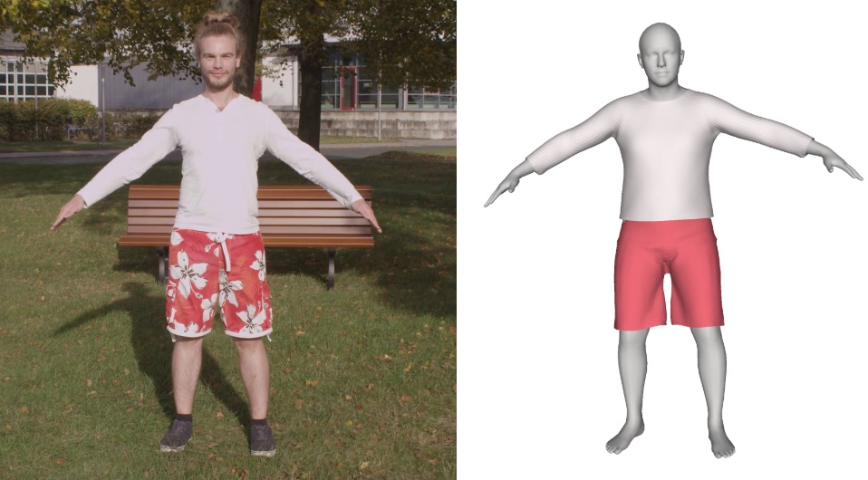
        </td>
        <td style="padding:20px;width:75%;vertical-align:middle">
            <papertitle><strong>BCNet: Learning Body and Cloth Shape from A Single Image</strong></papertitle>
            </a>
             
            Boyi Jiang, Juyong Zhang, Yang Hong, Jinhao Luo, Ligang Liu, Hujun Bao
             
            European Conference on Computer Vision (ECCV), 2020
             
            <a href="https://arxiv.org/abs/2004.00214">paper</a> /
            <a href="https://github.com/jby1993/BCNet">code</a>
            

            
In this paper, we consider the problem to automatically reconstruct garment and body shapes from a single near-front view RGB image. To this end, we propose a layered garment representation on top of SMPL and novelly make the skinning weight of garment independent of the body mesh.

        </td>
        </tr>
    </tbody>
</table>

<a name="BodyRepresentation"/>

## Body Representation

<table
    style="width:100%;border:0px;border-spacing:0px;border-collapse:separate;margin-right:auto;margin-left:auto;">
    <tbody>
        <tr>
        <td style="vertical-align:middle">
            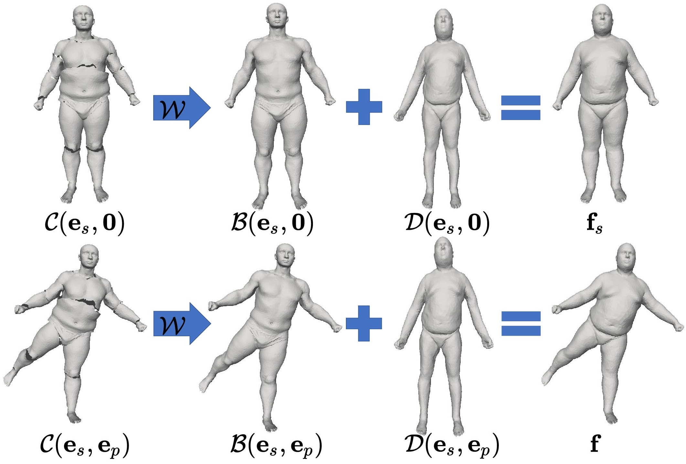
        </td>
        <td style="padding:20px;width:75%;vertical-align:middle">
            <papertitle><strong>Disentangled Human Body Embedding Based on Deep Hierarchical Neural Network</strong></papertitle>
            </a>
             
            Boyi Jiang, Juyong Zhang, Jianfei Cai, Jianmin Zheng
             
            IEEE Transactions on Visualization and Computer Graphics (TVCG), 2020
             
            <a href="https://arxiv.org/abs/1905.05622">paper</a> /
            <a href="https://github.com/Juyong/DHNN_BodyRepresentation">code</a>
            

            
This paper presents an autoencoder-like network architecture to learn disentangled shape and pose embedding specifically for the 3D human body.

        </td>
        </tr>
    </tbody>
</table>

<a name="HumanDigitization"/>

## Human Digitization

<table
    style="width:100%;border:0px;border-spacing:0px;border-collapse:separate;margin-right:auto;margin-left:auto;">
    <tbody>
        <tr>
        <td style="vertical-align:middle">
            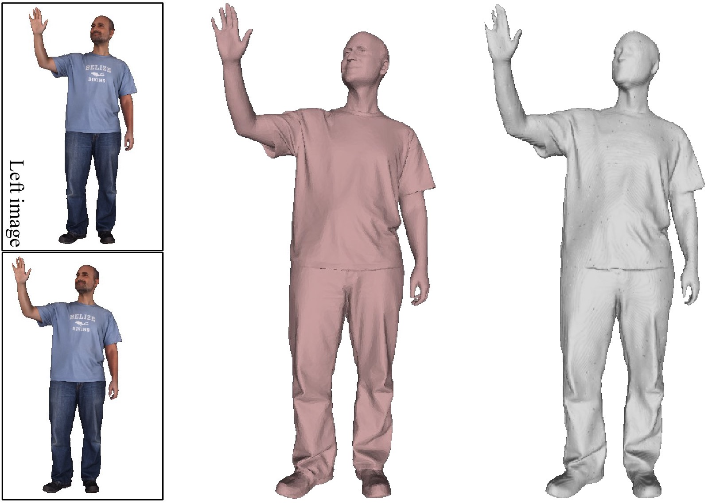
        </td>
        <td style="padding:20px;width:75%;vertical-align:middle">
            <papertitle><strong>StereoPIFu: Depth Aware Clothed Human Digitization via Stereo Vision</strong></papertitle>
            </a>
             
            Yang Hong, Juyong Zhang, Boyi Jiang, Yudong Guo, Ligang Liu, Hujun Bao
             
            IEEE/CVF Conference on Computer Vision and Pattern Recognition (CVPR), 2021
             
            <a href="https://arxiv.org/abs/2104.05289">paper</a> /
            <a href="https://hy1995.top/StereoPIFuProject/">project page</a> /
            <a href="https://github.com/CrisHY1995/StereoPIFu_Code">code</a>
            

            
We propose StereoPIFu, which integrates the geometric constraints of stereo vision with implicit function representation of PIFu, to recover the 3D shape of the clothed human.

        </td>
        </tr>
    </tbody>
</table>
